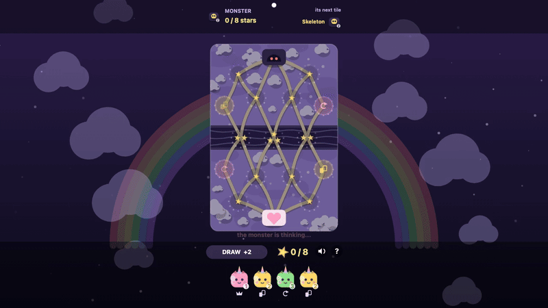

# Unicorn vs Nightmares

**js13kGames 2026 entry. Theme: Unicorns and Rainbows.**

A board game about lines: yours has to reach the monster's castle, and it only
counts as long as it still touches your own. Eight boards make a night. Win all
eight and you have won the game — that is the whole of it, there is no ninth.



*A real game, played by the game's own AI on both sides, recorded by
`scripts/record-gif.mjs`. The exact command is in
[Project layout](#project-layout).*

The whole thing is one HTML file under 13 kB, zipped. No images, no audio files,
no libraries. Every unicorn, every monster and all eight boards are drawn with
canvas paths, and every sound is generated with the Web Audio API.

The design is by Raphael, a kid who makes games with his dad and with Claude
Code. He wanted one where a unicorn protects a child's dream from the nightmare
monster, and where you never lose to bad luck, only to bad play.

---

## How to play

You place unicorn tiles on a board of seventeen zones linked by paths. It is a
network, not a grid: zone 0 is the monster's camp, zone 16 is yours, and zone
`i` mirrors zone `16 - i`, so neither side ever gets the better half.

On your turn you either place one unicorn or draw two. You win a board by
reaching the monster's castle, or by holding enough stars through one full enemy
turn. The monster always gets that one chance to steal them back, which is what
makes the last star the hard one. Win eight boards in a row and the night is
yours; lose one and the night is over, because there are no lives.

| Unicorn | Number | What it does |
|---|---|---|
| Pink | 1 | Covers every other tile, including the red |
| Yellow | 2 | Draw two more tiles |
| Green | 3 | Play again |
| Purple | 4 | Discard one enemy tile |
| Red | 5 | Strongest by number, covered only by pink |

The bigger number covers the smaller one; pink is the exception that beats
everyone, so the weakest tile is also the one that can undo the strongest.

### The rule people miss

Your line must start at your castle. Cut it anywhere and everything past the cut
goes pale and stops counting, stars included. It decides most games, which is why
severed tiles fade on screen instead of just disappearing.

### A night is eight boards

Eight boards, in a random order after the first. The cloud sky always comes first
because it doubles as the tutorial; the plush castle, the candy desert, the teddy
forest, the lily pond, the sand desert, the dream ice and the marshmallow volcano
follow in whatever order the run picks. Each has its own star layout, its own
number of stars to hold, between six and nine, and some hide tunnels linking two
zones that look unconnected.

**A night is those eight boards and nothing more.** Win the eighth and the game
is over and you have won it: the screen reads THE NIGHT IS YOURS, all 8 dreams
saved, the child sleeps. There is no ninth board, no endless mode, no harder loop
to wrap around into. Lose a board and the night ends there as well — there are no
lives, so the run you are on is the only one you get, and the final screen counts
the dreams you saved before the monster stopped you. Either way the final screen
reads TAP TO PLAY AGAIN and takes you back to the title, and the next run
reshuffles the seven boards that follow the cloud sky.

It did once loop forever, on a reshuffled deck of the same eight. Over 3000
simulated runs the furthest anyone ever got was a thirteenth board, so everything
beyond that was content no player would ever see, and two trophies hung past the
end of the reachable world. Stopping at eight also gives the score a meaning:
everybody plays the same eight.

The monster is deliberately sloppy at first and sharpens board after board, on
two dials that are not the same thing. The random term added to its move score is
`31 - 2.5 x level`: 28.5 points of noise on the first board, 11 on the eighth. It
never learns a new trick, it just stops making mistakes. Its *deck* hardens
separately — no tile above `level + 1`, so neither purple nor red exists early
on, and half the green "play again" tiles are downgraded before level 5. Measured
over 2000 games per level, the player wins 95 % of the first board and 47 % of
the eighth.

---

## Running it

```bash
nvm use        # Node 22
npm install    # two dev dependencies: terser and roadroller
npm run build  # produces dist/index.html and unicorn-night.zip
```

To play while editing, open `src/index.html` in a browser. There is nothing to
serve: the game is one file that fetches nothing, so `file://` behaves exactly
like a server. Use `npx serve .` if you want a real origin anyway.

`src/index.html` is the readable, commented source. That is the file to edit.
`dist/` and the zip are generated, never edited by hand.

```bash
RR_TRIES=30 npm run build   # 30 roadroller draws, keep the smallest. About 13 min
npm run build:dev           # skip roadroller: fast, and writes somewhere else
npm run build:lab           # rebuild the AI training lab
npm test                    # the one test, 13.6 s
```

`RR_TRIES` is not a knob you can leave alone any more. Each draw costs 26 s and
the default is five, which is no longer enough margin to rely on: see
[the lottery](#the-lottery-and-why-it-is-now-the-whole-story) further down. The
zip you submit should come from a build with at least 30.

`build:dev` deserves a word. A build flag that skips compression but still
overwrites the deliverable is a good way to submit an oversized zip by accident:
that build measures **16 290 B**, comfortably over the limit. So this one writes
to `dist/dev/` and `unicorn-night-dev.zip` instead, and the file you submit can
only come from a full build.

---

## The test

One file, `tests/test.js`, and why it is one file is worth more than the file.

A test earns its place in a finished 13 kB game when it checks something you can
neither **see** by playing nor **read** in the code. Everything else is a
tautology or a prosthesis: this game was written with an AI that cannot look at a
screen or listen to a speaker, so it grew tests that hashed pixels, counted
oscillators and measured text boxes. That was scaffolding for the author, not
information for the reader. Once a human had played the game and heard it, those
had nothing left to prove, and eight test files collapsed into one.

```bash
npm test    # 13.6 s, and upwards of 60 000 checks
```

The exact count moves from one run to the next — four runs measured here came out
at 64 033, 68 455, 68 661 and 72 457 — because the simulated games are random.
Only the thresholds are fixed.

Eight sections survived, in the order the console prints them, and each one knows
something that no eye and no reading can establish:

| Section | What it establishes |
|---|---|
| 1. The covering rule | Three assertions, and the only tautology left: bigger covers smaller, pink covers everyone. It is the axiom the other seven lean on. |
| 2. The eight boards | They are hand-typed literals. Nothing enforces that zone `i` mirrors zone `N-1-i` in stars, cell types, paths *and* castle entrances, that the goal is a majority of the board's stars, or that no zone is unreachable from a camp. An asymmetric board would be unfair in a way nobody would ever notice. |
| 3. Broken chains | The rule that decides most games, and the one a reader is most likely to get wrong: a zone counts only while it is still linked to your own castle, and covering a tile in the middle steals everything behind it. |
| 4. 2000 simulated games | Nobody plays 2000 games. This is how we know that no game deadlocks, that the eight boards are within 32 % of even at the neutral level, that difficulty rises, and that the eighth win ends the night on `runend` with `endWin` true, since the final screen tells victory from defeat by that flag alone. The first games of each board also verify **`legalFor()` in both directions**, move by move: the reverse one is what catches real bugs, because every zone touching your network that is takeable *must* be listed. It is a brute-force re-implementation, written deliberately unlike the game's. |
| 5. The tutorial | Replays all eleven scripted steps and checks the one rule it must never bend: the child plays twice in a row only when the move just made earned a replay, a green tile or a candy spot. Anything else hands the turn to the monster. |
| 6. 3000 random taps | Fuzzing every screen for a crash, which a human tester will not do. |
| 7. Global name collisions | One `<script>`, no modules, 198 globals: redeclaring a name is silent. It happened twice (`NB`, then `sPop`) and cost hours both times. Fifteen lines of static analysis. |
| 8. Wavedash | The fifteen trophy ids fired by the game match `wavedash-achievements.json`, and the **real terser output** is run against an SDK stub that type-checks its arguments. That is the trap described further down. |

The thresholds are sized against their own noise. Difficulty is measured over 800
games per level rather than 400, because at 400 the last level sits within two
standard deviations of its threshold and reports a false failure roughly once
every hundred runs. A test that cries wolf on a fresh clone is worse than no test.

## The AI training lab

`npm run build:lab`, then open `lab/labo-entrainement.html` in a real browser.
Three AIs play each other in a worker: random, the one shipped in the game, and
a learner whose fifteen weights evolve. Two search methods are available, a
genetic algorithm and a criterion-by-criterion sweep, with convergence curves,
statistics and a JSON export of the weights.

The lab is assembled from three files: `lab/lab-page.html` for the interface,
`lab/lab-core.js` for the AIs and the evolution loop, and the game engine itself,
lifted out of `src/index.html` at build time. That last part is the whole point.
The lab plays the actual game rather than a simplified model of it, and it cannot
drift: `scripts/build-lab.js` re-reads the `<script>` block out of the source on
every build, so there is no second copy of the engine to fall out of date. The
assembled page, `lab/labo-entrainement.html`, is generated and gitignored.

`lab/poids-appris.json` records the weights that were found and applied. The gain
came almost entirely from *lowering* two weights, the value of a star and the
value of stealing one: the AI was overvaluing stars and underplaying position.

Read the numbers in that file with care. They were measured while a bug in
`simGame` silently pinned every training game to board 0, so they describe one
board out of eight rather than the game. Re-measured over 12 000 games on all
eight boards once the bug was fixed, the tuned weights beat the old ones 52.4 %
of the time, not the 56 % recorded there. The gain is real but small, and it is
uneven: on some boards it is nothing at all. The bug itself is fixed — `simGame`
now takes the board from its caller — but the comment explaining what it cost was
kept in place at `lab/lab-core.js:79` rather than deleted along with it. The
cautionary tale is worth more than the result was.

---

## How the 13 kB budget is spent

The chain is in `scripts/build.sh`.

1. The `<script>`, `<style>`, `<title>` and `<meta viewport>` are pulled out of
   `src/index.html`.
2. **terser** minifies the JavaScript: five passes, top-level mangling, and
   property mangling restricted by an explicit regex to ten of our own data
   properties, so it can never touch a DOM name.
3. **roadroller** re-encodes the minified JS into a self-extracting bundle. This
   is the biggest single win in the chain, cutting terser's output by 60 %, and
   it is also the step that turns the build into a lottery — see below.
4. A minimal HTML shell is rebuilt around it:
   `<!doctype html><html lang=en><meta charset=utf-8>`, then the viewport, the
   title, the style and the canvas. No `<head>` and no `<body>`, since browsers
   insert those anyway. Two things are kept on purpose. `lang=en` says which
   language the page is in, which is what a screen reader reads it with. And the
   viewport meta is not cosmetic at all: without it a mobile browser lays the
   page out at 980 px wide and scales it down, which makes a game you play with
   your finger unplayable.
5. `zip -9`.
6. **advzip** recompresses the same bytes with zopfli. The build treats it as
   optional and keeps the step-5 zip without it, but that is no longer a real
   choice: step 5 comes out at 13 635 B and the limit is 13 312. Without
   `brew install advancecomp`, this game does not fit.

Measured on the current build, `RR_TRIES=30 npm run build`:

| Stage | Size |
|---|---|
| Readable source, JS only | 82 958 B |
| After terser | 43 370 B |
| After roadroller, best of 30 | 17 203 B |
| Final HTML | 17 654 B |
| After `zip -9` | 13 635 B |
| After advzip | **13 293 B** of 13 312 max |

Three of those lines are worth a second look.

The comments cost nothing, and this is measured rather than believed. There are
352 comment lines in `src/index.html`, 23 464 bytes of them — more than a quarter
of the source — and terser emits **43 370 B either way**: strip every one of them
and run the exact build options, and the output is the same number, not merely
the same order of magnitude. Roadroller never sees a comment. There is no budget
argument against explaining the code, and there never was.

advzip gave back 342 bytes for no change to the game at all, which makes it both
the cheapest win on the list and, at this margin, the one that decides whether
there is a submission.

And the last line is the one to read before anything else: **19 bytes of
margin**, not the 800-odd this section used to claim. That number is the reason
for everything below.

### The lottery, and why it is now the whole story

The same source does not produce the same zip twice. `roadroller -O2` runs a
randomised parameter search, so the build runs it `RR_TRIES` times, five by
default, and keeps the smallest draw.

That used to be a refinement. It is now what makes the entry fit. Twelve
independent draws were taken on the current source and each one carried through
the same HTML shell, `zip -9` and advzip:

```
13309  13312  13319  13324  13325  13325  13327  13327  13330  13331  13335  13338
```

**Ten of those twelve are over the 13 312 B limit.** One draw at random has
roughly one chance in six of fitting. What the build submits is not a draw, it is
the smallest of `RR_TRIES` draws, and that is the only reason there is a zip at
all: five draws found 13 308 B and thirty found 13 293 B on the runs measured
here, both below anything in the list above.

So read the margin the right way round. Nineteen bytes is not comfort, it is the
distance to a ceiling that five draws out of six land *above*, and the distance
is redrawn on every build. Raising `RR_TRIES` buys real odds — 25 extra draws
bought 15 bytes — but it does not remove the lottery, it only draws more tickets.
Anything added to `src/index.html` from here has to be paid for in the same
build, and a build that comes back at 13 310 B is not headroom, it is a lucky
draw.

One flaw in the selection is worth knowing about, because at this margin it could
one day matter. `build.sh` keeps the draw with the smallest **JavaScript**, while
the size that decides everything is the **zip after advzip**, and the two do not
rank identically. In the twelve draws above, two roadroller outputs of exactly
17 249 B zipped to 13 327 and 13 330 B, and a *larger* output of 17 250 B zipped
to 13 327 B. So the ordering is noisy by about 3 bytes near the bottom. It cost
nothing here — the smallest JS also produced the smallest zip, 17 227 B to
13 309 B — but selecting on the number that actually matters would remove the
last bit of luck in the chain, at the price of zipping every draw.

Never trust a margin written down here, including the ones in this section: read
the number the build prints, and if the build goes over budget it exits with a
non-zero status rather than leaving you a zip you might submit.

---

## Project layout

```
unicorn-night/
├─ src/index.html               the game, readable and commented. The only file to edit.
├─ scripts/
│  ├─ build.sh                  terser -> roadroller -> zip -> advzip, with a size report
│  ├─ build-lab.js              assembles the training lab from its three sources
│  └─ record-gif.mjs            replays a seeded game in Chromium -> media/gameplay.gif
├─ tests/test.js                the one test; its header explains why it is the only one
├─ lab/
│  ├─ lab-page.html             the lab's interface
│  ├─ lab-core.js               the three AIs and the evolution loop
│  ├─ poids-appris.json         the weights the search found, and what became of them
│  └─ labo-entrainement.html    assembled by npm run build:lab, gitignored
├─ media/
│  ├─ gameplay-desktop.gif      800x450, the GIF at the top of this README
│  ├─ gameplay-mobile.gif       300x563, the same run in the phone layout
│  ├─ gameplay.mp4              1280x720, 12 s, from record-gif.mjs --video
│  ├─ cover.png                 800x500, the cover the submission form asks for
│  └─ thumbnail.png             320x320, the thumbnail it asks for
├─ wavedash.toml                which game to upload to, and from which folder
├─ wavedash-achievements.json   the fifteen trophies, in the portal's import format
├─ package.json                 five npm scripts, two dev dependencies
├─ package-lock.json            pins terser and roadroller, so the zip size is reproducible
├─ .nvmrc                       Node 22
├─ .gitignore
├─ LICENSE                      MIT
├─ dist/                        written by npm run build, gitignored
└─ unicorn-night.zip            the file to submit, gitignored, rebuilt by npm run build
```

Four things are deliberately absent from the repository, and `.gitignore` is what
keeps them out: `dist/`, the zip, `lab/labo-entrainement.html` and the
`.js13k-check/` folder the pre-flight tooling writes. All four are regenerated by
a command that is in the repo, and a generated file that is committed is a file
that will one day disagree with its source. Leaving out the zip is also what
almost every js13k repository does: the organisers archive the submitted zip
themselves when they fork the repo.

`media/` is the exception, and it is a heavy one: it is 8.6 MB of the 8.8 MB this
repository weighs, and 5.8 MB of that is the single GIF at the top of this file,
which every visitor to the GitHub page downloads. Nothing in the build reads it,
and nothing in the game does either — the zip contains no image at all.
If that ever matters more than the animation does, `record-gif.mjs --encode-only
--gifWidth=480 --colors=48` re-encodes it in seconds without replaying the game.

`scripts/record-gif.mjs` drives a real Chromium: it seeds `Math.random`, takes
over `requestAnimationFrame` so the game advances by a fixed time step rather
than in real time, and lets the game's own `aiPlay` function play the player's
side. The recording is therefore reproducible to the byte, and the moves you
watch are the real engine's, not a scripted demo. `--video` encodes the same
window as an MP4. It needs Playwright and ffmpeg, deliberately kept out of
`devDependencies` so that `npm install` does not download a browser.

Tuning a GIF is a two-step job: `--keep` holds on to the simulated frames, then
`--encode-only` re-encodes them in seconds. Re-simulating for every setting
wastes minutes and, worse, compares different games instead of different
settings.

One thing to know before running it: **the script's default output is
`media/gameplay.gif`, which is not one of the files in this repository.** The
three that are here were each produced with explicit options and `--out`, so use
those rather than the bare `npm run gif`, which would write a fourth file nothing
refers to:

```bash
# the GIF at the top of this README (measured: 800x450 out)
node scripts/record-gif.mjs --w=1280 --h=720 --gifWidth=800 \
     --out=media/gameplay-desktop.gif
# the phone version — the script's own defaults, only the name changes
node scripts/record-gif.mjs --out=media/gameplay-mobile.gif
# the video
node scripts/record-gif.mjs --video --videoOut=media/gameplay.mp4
```

---

## Submitting to js13kGames 2026

The rules are at <https://js13kgames.com/rules>. Where this entry stands,
measured rather than assumed:

| Rule | Status |
|---|---|
| Zip of 13 312 bytes or less | 13 293 B with `RR_TRIES=30`, **19 to spare**, and it moves every build. Build it more than once |
| `index.html` at the top level of the zip | one entry, named `index.html`, no subfolder |
| No external resources whatsoever | no URL, no `fetch`, no external font; everything is drawn or synthesised. The Wavedash block only reads a global the host injects, and loads nothing |
| Public GitHub repo with readable, unminified source | `src/index.html`, commented throughout |
| The repo must be enough to *build* the game | `scripts/build.sh`, `package.json` and its lockfile |
| Works in latest Chrome and Firefox, no console errors | measured on this build, load plus 25 random clicks: **0 errors, 0 warnings** in both Chromium and Firefox |
| `localStorage` keys namespaced, never `localStorage.clear()` | the game writes nothing to `localStorage` |

Submissions close **13 September 2026 at 13:00 CEST**. Unfinished entries and
bugfix pull requests run to 14 September, and voting from 14 September to
4 October.

Two things are new in the 2026 edition and both touch this game. Every uploaded
zip is now run through an automatic in-browser test in Chromium, and console
errors block the next step; the announcement warns that the test machine has
constrained resources and names heavily compressed games, roadroller included, as
the case at risk. So it was measured, on this build, in Chromium, with the CPU
throttled through the DevTools protocol. Page load to `domInteractive`:

| CPU throttling | With roadroller | Terser only (`build:dev`) |
|---|---|---|
| none | 611 ms | 8 ms |
| 4x slower | 2 872 ms | 33 ms |
| 8x slower | 6 168 ms | 75 ms |

Roadroller decoding is therefore **99 % of the startup cost**. The game's own
setup — eight boards, the whole synthesised soundtrack, every path painted by
code — is the 8 ms.

The usual answer to that is roadroller's context count: fewer contexts decode
faster and cost bytes. **That lever no longer fits.** Measured on this source,
best of three draws each: 12 contexts, the default, gives 13 305 B; 9 contexts
gives 13 406 B. It costs **101 bytes**, and the build has 19. Buying decode speed
now means finding those bytes inside the game first. If the upload test ever
rejects the build for being slow, the rules page says to get in touch with the
organisers, and at this margin that is the cheaper move.

The other new thing: the site now generates its own thumbnail from a screenshot
taken right after load, which is a good reason for the title screen to be the
first thing painted.

### The Wavedash challenge

Wavedash is a browser-game platform, and the 2026 competition adds it as a
*challenge*: a checkbox on the same js13k entry, not a second submission. It
grants an extra week to deploy there, and nothing else — no new features, no
bugfixes during that week. Everything touching the code has to be published and
verified **before** the js13k deadline.

One line is mandatory. The platform injects a `Wavedash` global before the game
runs, and until `init()` is called the game stays hidden behind the platform's
loading screen. Everything the SDK touches sits in one block at the bottom of
`src/index.html`, with **one guard per call**: a shared `try/catch` would let a
single missing method take the others down with it. Nothing is loaded from the
network, so this breaks no js13k rule, and on js13kgames.com the whole block is
inert.

Fifteen trophies, and they work everywhere the game does. The banner announcing
them is drawn on the canvas by the game itself, so it shows up on js13kgames.com
and on a file opened from disk just as well as on Wavedash. When the SDK is
around the trophy is also stored on the player's account; when it is not, nothing
happens and the banner shows anyway.

There is also one leaderboard, called `score`, and unlike the trophies it exists
*only* on Wavedash, because it needs a server. Every run that ends with a score
above zero, won or lost, uploads it there once, from `nextBoard()`. The call is
`getOrCreateLeaderboard('score', 1, 0)` — descending, numeric, signatures read
off the SDK's own `.d.ts` — and the score is then uploaded by the board's `_id`
rather than by its name. `getOrCreate` rather than `get` so the leaderboard comes
into existence the first time anybody finishes a run, instead of silently
swallowing every score until somebody creates it by hand in the Developer Portal.
The score itself is
`(stars x 10 + tiles covered x 5 + tiles discarded x 5 + 60 if you won on stars)
x level`, added up over the boards of the night. The 60 is the interesting term:
winning on stars rather than storming the castle happens in only 38 % of runs, so
it is the rare line and the score is what says so. Late boards weigh more because
of the `x level`.

Eight of the fifteen are the ladder of the night, one per board won, held in the
`LVL` table and fired as `trophy(LVL[niv-1])`. A table rather than eight branches: the
ids cost less than the ifs, and the ladder reads in one glance.

| Trophy | How you get it |
|---|---|
| First Dream → Drifting Off → Deep Sleeper → Midnight Hour → Lucid Dreamer → Night Watch → Dawn Chaser → Dream Master | Win the 1st, 2nd, … 8th board of the night |
| Castle Raid | Win by reaching the monster's castle |
| Star Keeper | Win by holding your stars through a whole enemy turn |
| Pink Victory | Take the castle with the pink unicorn, the weakest tile of all |
| Quick Dream | Win a board in under 12 moves |
| Swift Dreamer | Win a board in under 13 seconds |
| Star Thief | Steal three stars with a single tile |
| Never Waking | Finish the whole night with 4500 points or more |

Two of those thresholds were measured rather than guessed. **13 seconds**: a won
board costs about 6 s of delay the engine forces on you whatever you do (`aiT`
plus the 0.7 s `wait` after each monster move) for a median of 5 player moves, so
13 s leaves roughly 1.4 s per move — comfortable on six boards, tight on THE
TEDDY FOREST at 513 ms. **4500 points**: re-measured over 4000 simulated
nights of eight boards, only 1.5 % reached the end of the night at all, and 2 of
those 59 passed 4500 — median score of a finished night 3390, best ever 5250. It
is a prestige threshold, and the simulated player is the game's own bot, which
plays with constant noise and ignores the scoring formula entirely, so a human
aiming at it will do better.

The label on the banner is derived from the trophy id, so `CASTLE_RAID` prints as
CASTLE RAID. Carrying a second table of display names would have cost more than
it was worth, which is also why the ids read well as banners.
`wavedash-achievements.json` holds the fifteen in the portal's bulk-import
format, so the ids cannot drift apart — and `npm test` fails if they ever do.
For the eight level trophies the test reads the `LVL` table off the loaded game
rather than pattern-matching the source, because the table is the source of truth
and a regex would only be a copy of it that can drift.

**The trap worth knowing about.** `terser --compress booleans_as_integers=true`
rewrites `true` as `1`. That is free everywhere except at an API boundary that
type-checks its arguments, and the Wavedash SDK does exactly that:
`setAchievement(id, !0)` becomes `setAchievement(id, 1)`, the SDK throws, our
guard swallows it, and no trophy is ever sent. Only from the build, never from
`src/index.html`, which is the nastiest shape a bug can take. The flag is gone
from `scripts/build.sh`, and section 8 of `npm test` runs the real terser
options — read out of `build.sh` rather than copied — against a stub that
validates its types the way the SDK does. Put the flag back and the test fails.

Two more things the SDK's docs do not say, found by reading its source:
`setAchievement()` silently does nothing until `requestStats()` has answered, and
nothing at all for an id the Developer Portal does not know. It returns `false`
either way.

### Before submitting

```bash
RR_TRIES=30 npm run build  # must print DANS LE BUDGET
unzip -l unicorn-night.zip # must show exactly one index.html, no __MACOSX
```

`RR_TRIES=30`, not a plain `npm run build`, and this is not a detail: the default
of five draws produced a 13 308 B zip on the run measured for this README, four
bytes under the limit, and a bad draw goes over. Build it, read the number, and
build it again if the margin is uncomfortable — the zip that ends up in
`unicorn-night.zip` is whichever build ran last, not the best one you ever saw.

Then open `dist/index.html` in Chrome *and* Firefox, play a full board, and check
the console is clean.

---

## Two things learned the hard way

**The champion the lab shows you is lying.** It is the maximum of many noisy
measurements, so it is almost always a lucky one. A champion announced at 62 %
over 200 games was worth 57 % over 8000. Only the white line on the convergence
curve, or the Verify button, tells the truth. That is not a bug in the lab; it is
the winner's curse, and it applies to any tournament that reports its best
contestant.

**Making the code shorter made the zip bigger.** Roadroller is a predictive
model, not a dictionary compressor: it rewards regularity, not brevity. Factoring
29 nearly identical circles into one function removed 828 bytes from the minified
source and added 9 to the zip. Six textbook js13k optimisations were tried here
and all six lost. What worked was deleting dead code and tuning the compression
chain, and the only way to tell one from the other was to measure the zip after
every attempt.

---

## Credits

Game design by **Raphael**, a kid learning to make games: the unicorns, the
nightmare monster, the eight dream worlds, and the rule that a broken line stops
counting.

Code and art direction pair-programmed with his dad and with Claude Code.

MIT licensed. Do whatever you like with it.
